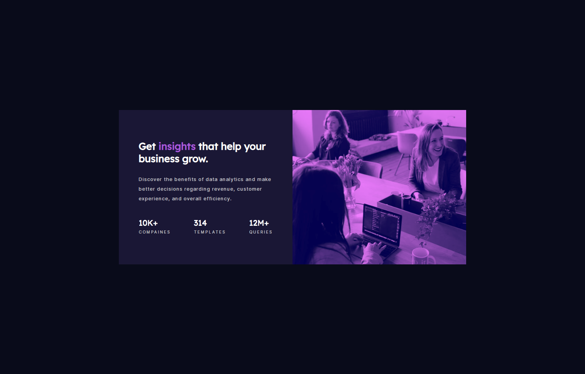

# Frontend Mentor - Stats preview card component solution

This is a solution to the [Stats preview card component challenge on Frontend Mentor](https://www.frontendmentor.io/challenges/stats-preview-card-component-8JqbgoU62). Frontend Mentor challenges help you improve your coding skills by building realistic projects. 

## Table of contents

  - [The challenge](#the-challenge)
  - [Screenshot](#screenshot)
  - [Links](#links)
- [My process](#my-process)
  - [Built with](#built-with)
  - [What I learned](#what-i-learned)
  - [Continued development](#continued-development)
- [Author](#author)
- [Acknowledgments](#acknowledgments)

### The challenge

Users should be able to:

- View the optimal layout depending on their device's screen size

### Screenshot

### Links

- Solution URL: [Add solution URL here](https://your-solution-url.com)
- Live Site URL: [Add live site URL here](https://your-live-site-url.com)

## My process

### Built with

- Semantic HTML5 markup
- CSS custom properties
- Flexbox
- CSS Grid
- SASS (Nesting and variables)
- Mobile-first workflow

### What I learned
- I attempted to follow the BEM and ITCSS method to make maintenance much easier. After going back and reading more about these methods, i relaised i still have a lot to learn!

- Overall, i'm quite happy with how much little code i used to style the responsive card component.

### Continued development
- I want to focos more on BEM method and creating better naming conventions
- ITCSS - to better organise styles for websites.
- Building complex responsive layouts with flexbox and implementing CSS Grid more

## Author
Thompson Urhiofe / (https://www.febrauryfourth.com)
- Frontend Mentor - @februaryfourth / https://www.frontendmentor.io/profile/februaryfourth 
- Twitter - [@thompson_ui]/ https://twitter.com/Thompson_ui

## Acknowledgments

I  want to thank my 7 year old daughter always telling me to hurry up so we can play hide and seek insetead of coding. 
